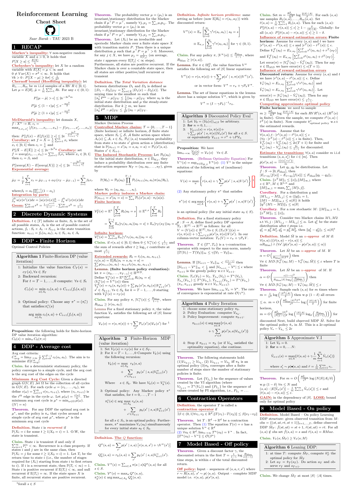

---

# Reinforcement Learning Toolkit 🎓

An extensive, easily-referenced Toolkit for reinforcement learning, developed as part of the TAU-23 course.

This repository contains a comprehensive set of reference documents for the course, organized into individual LaTeX files for each main topic. This allows for quick access to specific sections when you need to brush up on a particular topic.

## 📚 Contents

The cheat sheet is divided into the following sections:

1. **Recap**: [RECAP.tex](./RECAP.tex)
2. **Discrete Dynamic Systems**: [Discrete_Dynamic_Systems.tex](./Discrete_Dynamic_Systems.tex)
3. **DDP - Finite Horizon**: [DDP_-_Finite_Horizon.tex](./DDP_-_Finite_Horizon.tex)
4. **DDP - Average Cost**: [DDP_-_Average_cost.tex](./DDP_-_Average_cost.tex)
5. **MDP**: [MDP.tex](./MDP.tex)
6. **Contraction Operators**: [Contraction_Operators.tex](./Contraction_Operators.tex)
7. **Model Based - Off Policy**: [Model_Based_--_Off_policy.tex](./Model_Based_--_Off_policy.tex)
8. **Model Based - On Policy**: [Model_Based_-_On_policy.tex](./Model_Based_-_On_policy.tex)
9. **Homework**: [Homework.tex](./Homework.tex)

A comprehensive file ([main.tex](./main.tex)) is also included, which compiles all the above sections into a single, seamless document.

## 🖼️ Preview

Here's a sneak peek of the first page of the compiled document:

## 🚧 Work in Progress
Please note that this cheat sheet is not yet complete, and there are many more sections we plan to add.

We're always looking for more contributors to help us expand this resource. If you're interested in helping to improve the cheat sheet, please feel free to fork the repository, make your changes, and submit a pull request. We welcome all contributions and would be thrilled to have you join our team of collaborators!

---

